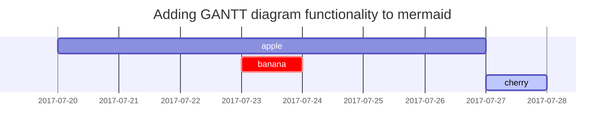

这是写博客的模板XD

## 标题
---
# H1 - heading

<h2 data-toc-skip>H2 - heading</h2>

<h3 data-toc-skip>H3 - heading</h3>

<h4>H4 - heading</h4>
通过插入HTML代码块来实现，也就是<>和</>


---

## 段落

正文

## 列表

### 顺序列表

1. 第一点
2. 第二点
3. 第三点

### 未分类列表

- Chapter
  + Section
    * Paragraph

### 要做的列表

- [ ] Job
  + [x] Step 1
  + [ ] Step 2
  + [x] Step 3

### 描述列表

小标题1
: 描述内容

小标题2
: 描述内容

## 块语句

> 正文

## 提示

> 启发
{: .prompt-tip }

> 提示
{: .prompt-info }

> 警告
{: .prompt-warning }

> 危险
{: .prompt-danger }

## 表格

| Company                      | Contact          | Country |
|:-----------------------------|:-----------------|--------:|
| Alfreds Futterkiste          | Maria Anders     | Germany |
| Island Trading               | Helen Bennett    | UK      |
| Magazzini Alimentari Riuniti | Giovanni Rovelli | Italy   |

## 链接

<http://127.0.0.1:4000>

## 论文引用

Click the hook will locate the footnote[^footnote], and here is another footnote[^fn-nth-2].

## 反引号包围

例子 `Inline Code`.

## 文件路径

文件路径 `/path/to/the/file.extend`{: .filepath}.

## 代码块

### 普通

```
This is a common code snippet, without syntax highlight and line number.
```

### 语言

```bash
if [ $? -ne 0 ]; then
  echo "The command was not successful.";
  #do the needful / exit
fi;
```

### 文件内容

```sass
@import
  "colors/light-typography",
  "colors/dark-typography"
```
{: file='_sass/jekyll-theme-chirpy.scss'}

## 数学公式

The mathematics powered by [**MathJax**](https://www.mathjax.org/):

$$ \sum_{n=1}^\infty 1/n^2 = \frac{\pi^2}{6} $$

When $a \ne 0$, there are two solutions to $ax^2 + bx + c = 0$ and they are

$$ x = {-b \pm \sqrt{b^2-4ac} \over 2a} $$

估计用不到

## SVG



## 图像

### 默认图像

{: width="972" height="589" }
_Full screen width and center alignment_

### Left aligned

{: width="972" height="589" .w-75 .normal}

### 左图像右文字

{: width="972" height="589" .w-50 .left}
文字

### 右图像左文字

{: width="972" height="589" .w-50 .right}
文字

## 视频



## 引用（论文用）

[^footnote]: The footnote source
[^fn-nth-2]: The 2nd footnote source
